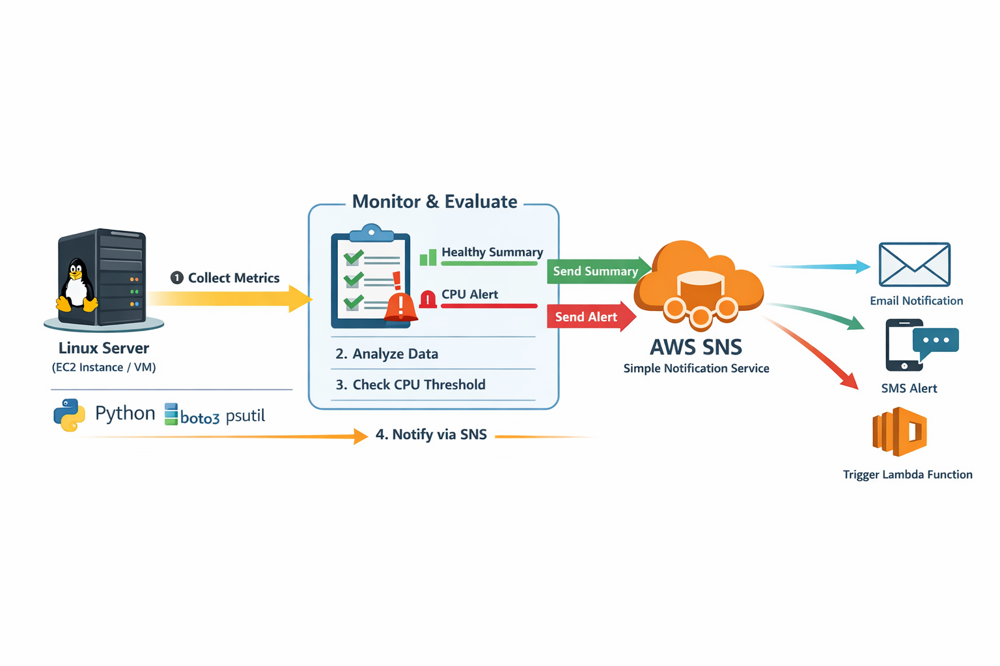

# Dr. Health Care -Server Health Monitor with AWS SNS 
### (Cost-Optimized Alternative to CloudWatch Alarms)

---

## 🚀 Project Overview

This project is a **lightweight Python-based server monitoring tool** that collects system health metrics such as **CPU usage, Memory usage, and Disk usage** from a Linux server and sends:

- ✅ Periodic health summaries  
- 🚨 CPU threshold-based alerts  

directly to **AWS SNS (Simple Notification Service)** without using AWS CloudWatch alarms.

It is designed as a **cost-saving monitoring solution** for small and medium-scale servers where full CloudWatch monitoring is unnecessary.

---
## 🧰 Tech Stack & Tools


---


---

## 🎯 Why This Project?

AWS CloudWatch provides deep monitoring, but it introduces extra cost through:

- Custom metrics  
- Detailed monitoring  
- Alarm pricing  

This project:

✔ Runs locally on the server  
✔ Uses open-source Python libraries  
✔ Sends alerts only when required  
✔ Uses low-cost AWS SNS  

➡ Result: **Near-zero cost server monitoring**

---


---

## ⚙️ Features

- CPU utilization monitoring  
- Memory utilization monitoring  
- Disk usage monitoring  
- Color-coded console output  
- JSON formatted metric output  
- Automated email alerts  
- Severity-based CPU levels  
- Hostname and timestamp tracking  

---

## 🛠 Tech Stack

| Layer | Technology |
|-----|-----------|
| Programming Language | Python 3 |
| Metrics Collection | psutil |
| AWS SDK | boto3 |
| Cloud Service | AWS SNS |
| Operating System | Linux |
| Scheduler (Optional) | Cron |

---

## 🔐 AWS Credentials & Configuration

Before running the script, update the following variables inside the Python file:

```python
AWS_ACCESS_KEY = "YOUR_ACCESS_KEY"
AWS_SECRET_KEY = "YOUR_SECRET_KEY"
AWS_REGION     = "eu-north-1"
SNS_TOPIC_ARN  = "arn:aws:sns:region:account-id:topic-name"

```
## ▶️ How It Works

1. Script collects CPU, Memory, and Disk metrics  
2. Formats data into a readable summary  
3. Sends summary to AWS SNS  
4. Checks CPU threshold  
5. If threshold is exceeded → sends alert notification  

---

## 📩 Alert Levels

| CPU Usage | Level |
|----------|------|
| 0–40% | Normal |
| 41–60% | Moderate |
| 61–80% | High |
| 81%+ | Critical |

---

## ⏰ Automating with Cron

Run the script automatically every 5 minutes.

Edit crontab:

```bash
crontab -e
```
```
*/5 * * * * /usr/bin/python3 /path/to/monitor.py
```
---
👩‍🏫 **Guided and Supported by [Trupti Mane Ma’am](https://github.com/iamtruptimane)**  
---

👨‍💻 **Developed By:**  
**Shivam Garud**  
🧠 *DevOps & Cloud Enthusiast*  
💼 *Automating deployments, one pipeline at a time!*  
🌐 [GitHub Profile](https://github.com/Shivamgarud8)
🌐 [Medium blog](https://medium.com/@shivam.garud2011)
🌐 [Linkedin](https://www.linkedin.com/in/shivam-garud/)
🌐 [PortFolio](https://shivam-garud.vercel.app/)


